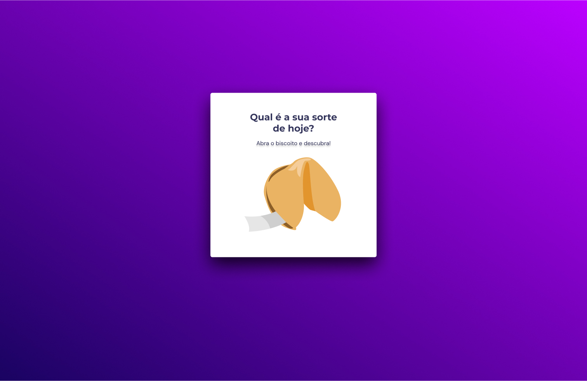

<h1> Biscoito da Sorte </h1>

 

<h2> O Projeto </h2>

O projeto foi desenvolvido como desafio do módulo 05 do curso Explorer da Rocketseat.  

Neste jogo, o usuário a partir de um clique, abre um biscoito com a sorte do seu dia.

  

 

Como jogar

- O usuário deve clicar sobre a imagem do biscoito da sorte;
- Na tela seguinte aparecerá uma mensagem com a sua sorte;
- Caso queira, o usuário poderá clicar na opção para Jogar novamente.

 

Quer conferir e testar sua sorte do dia? 

[Visite o projeto online](https://eltonprado.github.io/Projeto10_JogoDaAdivinhacao/)

 

<h2> O intuito do projeto </h2>

O intuito do projeto foi colocar em prática os conhecimentos acerca de:

- Estrutura de dados HTML
- Animações com CSS
- Funções no Javascript
- Manipulação da DOM
- Biblioteca JS Math()
- Funções callback
- Arrays

 

<h2> Tecnologias </h2>

Foi utilizado as seguintes tecnologias para desenvolver esse projeto:

- HTML
- CSS
- JavaScript
- Git
- GitHub
